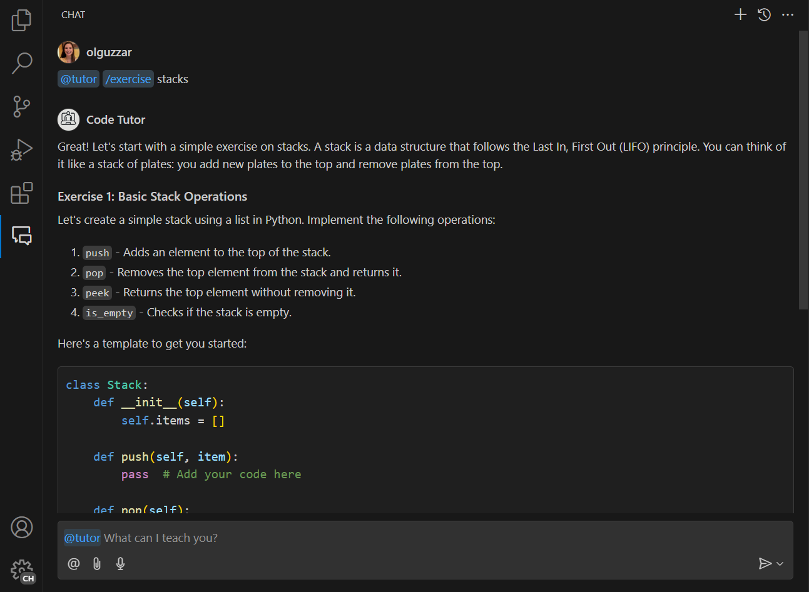

# Sid's Assistant

A personal AI assistant extension for Visual Studio Code that uses local Ollama models to provide AI assistance without sending your data to external services.

This VS Code extension shows:

- How to contribute a chat participant to VS Code's chat interface
- How to integrate with local Ollama models for AI responses
- How to provide a model selection UI for choosing different Ollama models

Documentation can be found here:
- https://code.visualstudio.com/api/extension-guides/chat
- https://code.visualstudio.com/api/extension-guides/chat-tutorial

## Running the Extension

- Install [Ollama](https://ollama.ai) on your system
- Pull at least one model using `ollama pull MODEL_NAME` (e.g., `ollama pull llama3.2:3b`)
- Run `npm install` in terminal to install dependencies
- Run the `Run Extension` target in the Debug View. This will:
	- Start a task `npm: watch` to compile the code
	- Run the extension in a new VS Code window
	- You will see the @assistant chat participant in the chat view

## Features

- **Personal Assistant**: General-purpose AI assistant that can help with a wide variety of tasks
- **Local Model Integration**: Uses Ollama to run AI models locally on your machine
- **Model Selection**: Click on the status bar item or run the "Sid's Assistant: Refresh and Select Ollama Models" command to choose from available Ollama models
- **Status Bar Indicator**: Shows the currently selected model in the status bar
- **Multiple Modes**:
  - **Default Mode**: General purpose assistant for any kind of task
  - **Tutor Mode**: Use the `/tutor` command to switch to learning mode
  - **Exercise Mode**: Use the `/exercise` command to get programming exercises

## Requirements

- Visual Studio Code 1.93.0 or higher
- [Ollama](https://ollama.ai) installed and running
- At least one model pulled in Ollama

## Usage

- Type `@assistant` in the chat view to start interacting with Sid's Assistant
- For tutoring help, use `@assistant /tutor` followed by your question
- For practice exercises, use `@assistant /exercise` followed by the concept you want to practice
